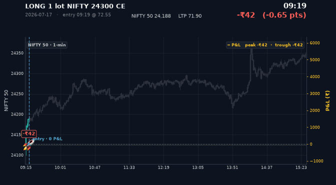
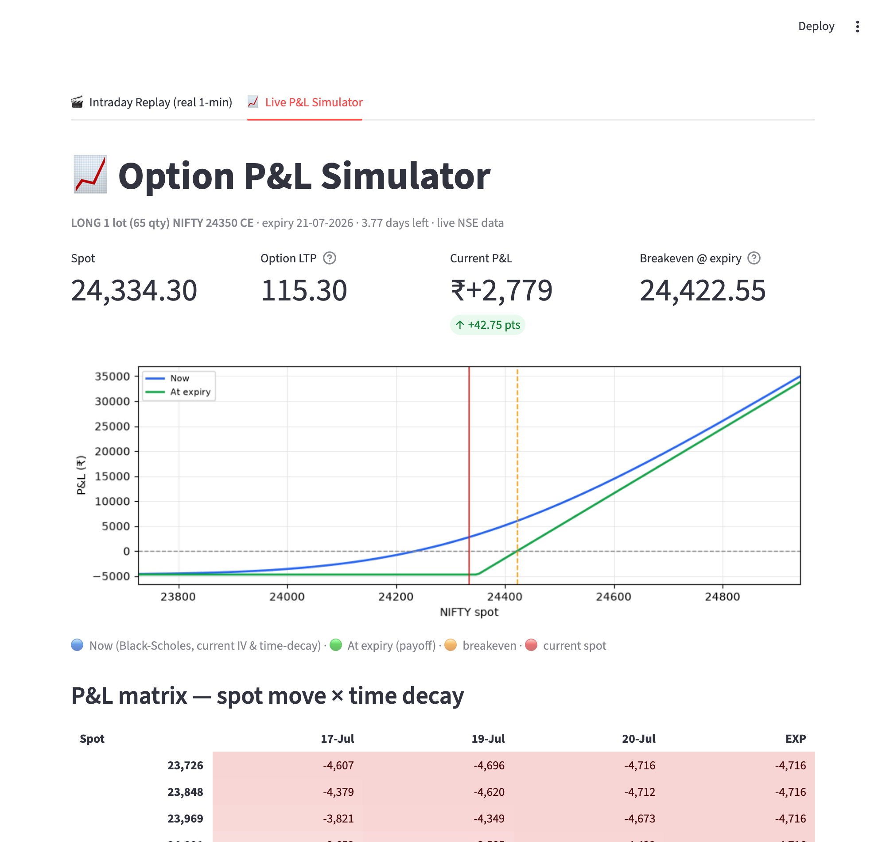

# 📈 NIFTY Intraday Option P&L Replay & Simulator

A Streamlit app for **NIFTY / BankNifty option traders** that does two things:

1. **🎬 Intraday Replay** — pick a contract + your entry, and watch how your P&L
   would have moved **minute-by-minute through a real trading day**, rendered as a
   video/GIF: NIFTY 50 1-minute candles with your P&L riding on top. 🚀
2. **📈 Live P&L Simulator** — a live Black-Scholes payoff + time-decay grid for an
   option position, using the current NSE snapshot.

**No broker login, no API key** — all data comes from public endpoints.

<!-- After deploying, replace the URL below with your app's, e.g. https://nifty-option-pnl-replay.streamlit.app -->
[](https://abhishekkoshta-nifty-option-pnl-replay-app-jfgjll.streamlit.app/)



---

## Why it's useful

Brokers show you the *final* P&L of a trade. They don't show you the **journey** —
how close you were to the peak, how deep the drawdown got, how long you sat in
profit. This replays the whole day on **real 1-minute traded prices** so you can
review your entry/exit like game tape.

The P&L matches your broker exactly: `(LTP − entry) × qty`, gross — e.g. long 1 lot
NIFTY 24300 CE @ 72.55 closing at 141.95 → **+₹4,511 (+95.66%)**.

---

## Features

**🎬 Intraday Replay (default tab)**
- Real **1-minute OHLC** for any listed strike (CE/PE), NIFTY / BANKNIFTY / FINNIFTY.
- **NIFTY 50 candlesticks** on the primary axis; **P&L (₹)** on a secondary axis with
  your **entry marked at 0 P&L** and a 🚀 tracking the live P&L.
- Pick **entry time & price**, **exit time**, **lots**, and **video length** (5–35 s).
- Export the replay as an **MP4** (H.264) or an **animated GIF**.
- Running **max profit / max drawdown / % time in profit**, plus **Return %** (broker "Chg.").
- Fetched days are **cached to disk** (`min_cache/`) — replays are instant on re-open.

**📈 Live P&L Simulator**
- Live NSE spot + option LTP (public option-chain), Black-Scholes reprice.
- Payoff chart (now vs at-expiry) + a colored **spot × time-decay** P&L matrix.
- Manual override if NSE blocks the host.



---

## Data sources (all public, no login)

| What | Source |
|------|--------|
| Historical **1-minute** option & index candles | Upstox public `historical-candle` API + instrument master |
| Live option-chain snapshot (Live tab) | NSE public option-chain API |

> **Coverage note:** the replay works for contracts **still listed** (expiry ≥ today),
> over their full life — i.e. the last few weeks of the current weekly/monthly. Already
> **expired** weekly contracts drop out of the free master and aren't retrievable here.
> Great for reviewing **recent** trades.

---

## Quick start

```bash
git clone https://github.com/AbhishekKoshta/nifty-option-pnl-replay.git
cd nifty-option-pnl-replay
pip install -r requirements.txt
streamlit run app.py
```

Then open <http://localhost:8501>.

**Command-line** version of the live simulator:

```bash
python3 simulate.py --strike 24300 --type CE --entry 72.55 --lots 1
```

---

## Deploy your own (Streamlit Community Cloud — free)

This repo is deploy-ready — no Dockerfile, no server. Because the app writes only
to an ephemeral on-disk cache and pulls all data from public endpoints, it runs
as-is on the free tier.

1. Fork or push this repo to your GitHub account.
2. Go to **[share.streamlit.io](https://share.streamlit.io)** and sign in with GitHub.
3. **New app → From existing repo**, then set:
   - **Repository:** `your-username/nifty-option-pnl-replay`
   - **Branch:** `main`
   - **Main file path:** `app.py`
   - *(Advanced settings)* **Python version:** `3.12` or `3.13`.
4. Click **Deploy**. First build takes a few minutes (it installs
   `fonts-noto-color-emoji` from `packages.txt` so the 🚀 renders on Linux).

Files that make cloud deployment work:

| File | Purpose |
|------|---------|
| `requirements.txt` | Python deps (pandas is pinned to 2.x on the cloud's Python) |
| `packages.txt` | apt packages — installs the colour-emoji font for the 🚀 |
| `.streamlit/config.toml` | dark theme + proxy-friendly server settings |

> **Live tab on the cloud:** NSE's public option-chain API often blocks
> datacenter IPs, so the **Live P&L Simulator** tab may not fetch a live snapshot
> from Streamlit's servers — use its **manual override** to enter spot/LTP by hand.
> The **Intraday Replay** tab (Upstox) works fine from the cloud.

---

## Project structure

```
app.py            Streamlit app — both tabs (entry point)
upstox_data.py    Free 1-min candle fetch (Upstox) + instrument master + disk cache
replay_engine.py  P&L computation + dark-theme frame renderer → MP4 / GIF
bs.py             Black-Scholes pricing (no scipy)
nse_data.py       Live NSE option-chain / spot (for the Live tab)
simulate.py       CLI for the live simulator
requirements.txt  Dependencies
docs/             Demo media
```

Charts render as matplotlib PNGs and tables as HTML — the app is deliberately
**pyarrow-free** to avoid a Streamlit/pyarrow thread-crash on Python 3.14+
(see the comment block at the top of `app.py`).

---

## Requirements

Python 3.10+, and the packages in `requirements.txt` (Streamlit, pandas, matplotlib,
requests, imageio-ffmpeg, Pillow). The MP4 encoder ships with `imageio-ffmpeg` — no
system `ffmpeg` needed.

> The 🚀 marker uses the system color-emoji font (Apple Color Emoji on macOS); if it's
> unavailable the app falls back to a colored dot automatically.

---

## Disclaimer

For **education and personal trade review only**. Not investment advice. Data may be
delayed or incomplete; P&L figures are **gross** (no brokerage/STT/taxes). Verify
anything important against your broker. Use at your own risk.

## License

MIT — see [LICENSE](LICENSE). (Replace `<YOUR NAME>` in the license file.)
